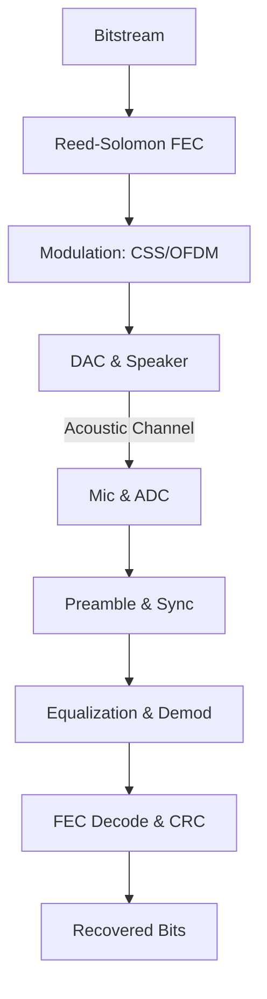

# Soundwave: Ultrasonic Physical Layer

[](LICENSE)
[](#1-acoustic-channel-profile)
[](#2-modulation-scheme-comparison)
[](#project-roadmap)

Soundwave is an experimental physical layer (PHY) communication platform designed to transmit digital data between nearby devices using **ultrasonic audio waves**. It maps digital bitstreams into high-frequency acoustic signals (typically above the human hearing threshold but within the frequency response of consumer speakers and microphones) and decodes them on the receiving side.

---

## 📊 Acoustic Data Insights & Channel Limits

Acoustic communication channels are constrained by the physical properties of air and sound propagation. Below are key parameters and empirical performance insights.

### 1. Acoustic Channel Profile

| Parameter | Value / Range | Description |
| :--- | :--- | :--- |
| **Propagation Velocity ($c$)** | $\approx 343 \text{ m/s}$ (at $20^\circ\text{C}$) | Slow speed of sound introduces severe delay spreads (multipath) and significant Doppler scaling. |
| **Target Band** | $18.0 \text{ kHz}$ to $22.0 \text{ kHz}$ | Ultrasonic band designed to remain inaudible to adults while utilizing standard $44.1 \text{ kHz}$ sampling hardware. |
| **Available Bandwidth ($B$)** | $4.0 \text{ kHz}$ | Restricts maximum raw data rates compared to RF networks. |
| **Acoustic Path Loss ($\alpha$)** | $\approx 0.6 \text{ to } 0.9 \text{ dB/meter}$ | Highly dependent on air temperature, humidity, and frequency ($f^2$ relation). |

### 2. Modulation Scheme Comparison

Soundwave supports two main PHY layer modulation formats. The following table provides insights into their performance trade-offs:

| Metric / Dimension | Chirp Spread Spectrum (CSS) | Orthogonal Frequency Division Multiplexing (OFDM) |
| :--- | :--- | :--- |
| **Throughput / Bit Rate** | Low ($\approx 50 - 200 \text{ bps}$) | High ($\approx 1 - 4 \text{ kbps}$) |
| **Multipath Fading Resistance** | Excellent (via matched filter processing gain) | Moderate (requires cyclic prefix $T_{cp} > \tau_{max}$) |
| **Doppler / Motion Tolerance** | Very High (linear frequency shift maps to time delay) | Low (requires precise pilot estimation & equalization) |
| **Required SNR** | Low (de-spreads signals below the noise floor) | High ($\ge 12 \text{ dB}$ for QPSK) |
| **Primary Use Case** | Frame synchronization, bootstrap exchange, noisy rooms | Large file/message payload handoffs |

### 3. Estimated Range vs. Attenuation at 20°C & 50% Humidity

| Frequency ($f$) | Attenuation Coeff ($\alpha$) | Max Operating Range ($P_{tx} = 80 \text{ dB SPL}$) | Max Operating Range ($P_{tx} = 65 \text{ dB SPL}$) |
| :--- | :--- | :--- | :--- |
| **18.0 kHz** | $0.62 \text{ dB/m}$ | Up to $10.5 \text{ meters}$ | Up to $4.2 \text{ meters}$ |
| **20.0 kHz** | $0.76 \text{ dB/m}$ | Up to $7.8 \text{ meters}$ | Up to $3.1 \text{ meters}$ |
| **22.0 kHz** | $0.92 \text{ dB/m}$ | Up to $5.4 \text{ meters}$ | Up to $2.2 \text{ meters}$ |

---

## 🧮 Physical Layer Mathematical Model Summary

For the complete, mathematically rigorous equations of the physical layer, refer to the [MATHEMATICAL_MODEL.md](./docs/MATHEMATICAL_MODEL.md) file. Below is a high-level summary of the core equations.



### 1. Attenuation Model
Acoustic pressure attenuation increases exponentially over distance $d$ based on Stokes' Law:
$$A(d, f) = d^{-\gamma} \cdot e^{-\alpha(f) d}$$

### 2. Linear Frequency Modulated (LFM) Chirp
CSS symbols are synthesized using LFM chirps:
$$s(t) = A \cos \left( 2\pi \left( f_0 + \frac{B}{2T} t \right) t + \phi_0 \right)$$

### 3. OFDM Subcarrier Generation
High-rate frames synthesize orthogonal subcarriers via the Inverse Discrete Fourier Transform (IDFT):
$$x[n] = \frac{1}{\sqrt{N}} \sum_{k=0}^{N-1} X_k e^{j \frac{2\pi k n}{N}}$$

### 4. Frame Synchronization
Timing and frequency synchronization are calculated using cross-correlation metrics and Schmidl-Cox autocorrelation:
$$\Delta \hat{f}_c = \frac{f_s}{2\pi N} \angle \left( \sum_{n=0}^{N-1} y^*[n] y[n + N] \right)$$

---

## 🚀 Getting Started & Architecture

At this stage, the repository is focused on the project's physical-layer specifications and design parameters. The codebase will be expanded according to the following architecture:

```
├── LICENSE
├── CONTRIBUTING.md
├── README.md
├── docs/
│   ├── MATHEMATICAL_MODEL.md     <-- Mathematical formulations
│   ├── PRD.md                    <-- Product Requirements Document
│   ├── TECH_STACK.md             <-- Technology Stack Specification
│   ├── CI_CD.md                  <-- CI/CD Pipeline Specification
│   └── ROADMAP.md                <-- Implementation Roadmap
├── src/                          <-- (Future implementation)
│   ├── encoder/                  <-- RS coding & CRC insertion
│   ├── modulator/                <-- CSS & OFDM signal generation
│   ├── channel/                  <-- Acoustic simulation models
│   └── receiver/                 <-- Frame sync, FFT, equalization
```

## 🛠️ Contributing

Please review [CONTRIBUTING.md](./CONTRIBUTING.md) before opening issues or pull requests.

## 👥 Core Developers & Maintainers

This project is developed under the **[PxA Labs](https://github.com/PxA-Labs)** organization by:
- **Archit Mittal**
- **Purvansh Joshi**

## 📄 License

This project is licensed under the MIT License. See [LICENSE](./LICENSE) for details.
