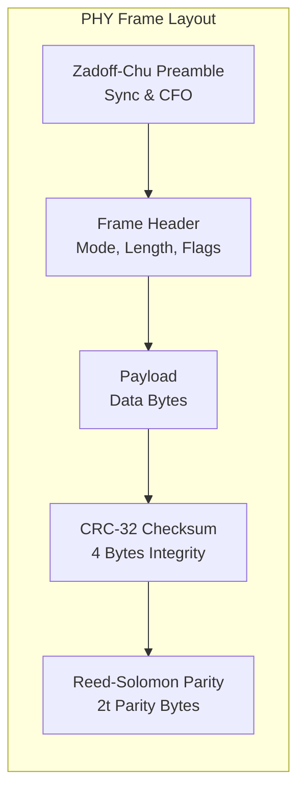
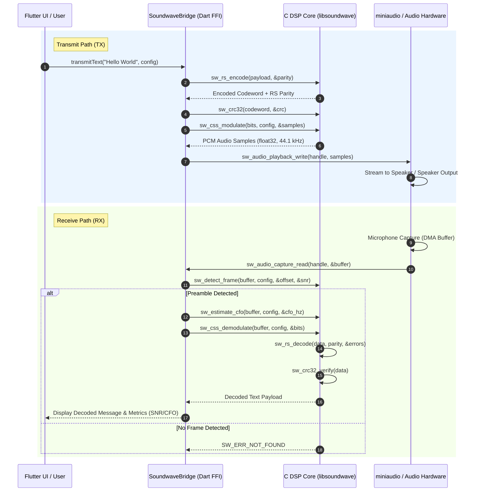

# Soundwave Developer & Architecture Guide

Welcome to the Soundwave Physical Layer (PHY) developer guide! This document provides an architectural sitemap, visual sequence diagrams, memory management contracts across the Dart FFI boundary, and setup instructions for contributors building or extending the native C library and Flutter application.

---

## 1. Architectural Sitemap & Repository Overview

```
ultrasonic-phy-layer/
├── docs/                        # Specifications & Mathematical Models
│   ├── MATHEMATICAL_MODEL.md    # PHY equations (GF(2^8), Chirp, OFDM, ZC)
│   ├── PRD.md                   # Product Requirements Document
│   ├── ROADMAP.md               # Implementation Roadmap & Milestones
│   ├── TECH_STACK.md            # Technology stack details
│   ├── DEVELOPER_GUIDE.md       # Architecture & Developer Guide (This file)
│   └── API_REFERENCE.md         # Comprehensive C/C++ & FFI API Reference
├── native/                      # C/C++ PHY Core DSP Library
│   ├── include/                 # Public C headers
│   │   ├── soundwave_api.h      # Public C FFI boundary API
│   │   └── soundwave/           # Module headers (rs, crc, css, ofdm, sync, audio)
│   ├── src/                     # C DSP source code
│   │   ├── rs/                  # GF(2^8) & Reed-Solomon Codec
│   │   ├── crc/                 # CRC-32 IEEE 802.3 Checksum
│   │   ├── css/                 # Chirp Spread Spectrum Modulator/Demodulator
│   │   ├── ofdm/                # OFDM Modulator/Demodulator & FFT
│   │   ├── sync/                # Timing Sync & Schmidl-Cox CFO Estimation
│   │   ├── audio/               # miniaudio I/O & Thread-Safe Ring Buffer
│   │   └── api/                 # C API implementation & FFI helpers
│   ├── vendor/                  # Vendored dependencies (KissFFT v131, miniaudio)
│   ├── tests/                   # CTest & Catch2 Unit / Integration Tests
│   └── benchmarks/              # Microbenchmarks & Performance Harness
├── soundwave_app/               # Flutter UI & Cross-Platform Host Application
│   ├── lib/                     # Dart source code
│   │   ├── bridge/              # dart:ffi C bindings wrapper (SoundwaveBridge)
│   │   ├── features/            # UI screens (TX, RX, Settings, Spectrum)
│   │   └── services/            # Audio Service & Frame Pipeline
│   └── test/                    # Flutter widget and unit tests
└── .github/                     # Workflows, Codeowners & PR Templates
```

---

## 2. PHY Frame Architecture & Data Flow

Soundwave transmits data over ultrasound (18 kHz – 20 kHz) by encapsulating payloads into structured PHY frames.

### Ultrasonic PHY Frame Structure



### End-to-End Transmit & Receive Sequence Flow

The diagram below illustrates the multi-tier interaction between the Flutter UI, Dart FFI Bridge, Native C DSP Core, and OS Audio Hardware (`miniaudio`):



---

## 3. FFI Memory Ownership Contracts & Buffer Lifecycle

When calling C code from Dart via `dart:ffi`, managing memory safely across the language boundary is paramount to prevent memory leaks and dangling pointer crashes.

### Memory Rules

1. **Caller Allocates, Callee Fills**:
   - The Dart caller (`SoundwaveBridge`) MUST allocate memory buffers using `ffi.calloc` or `ffi.malloc` before passing pointers to C functions.
   - Native C functions write into pre-allocated memory buffers and return written lengths via output parameter pointers (`size_t*`).

2. **Caller Frees**:
   - Any memory allocated by Dart MUST be freed by Dart using `calloc.free(ptr)` inside a `try ... finally` block after the native call completes.
   - Native C functions in `libsoundwave` DO NOT retain or free pointers passed to them.

3. **Buffer Length Estimation Formulas**:
   - **RS Parity Allocation**: $N_{\text{parity}} = 2t = N_{\text{block}} - K_{\text{data}}$ bytes (default 32 bytes for $RS(255, 223)$).
   - **CSS Audio Samples**: $N_{\text{samples}} = N_{\text{bits}} \times T_{\text{symbol}} \times f_s$ floats (where $f_s = 44100\text{ Hz}$).
   - **OFDM Audio Samples**: $N_{\text{samples}} = \lceil N_{\text{bits}} / (\text{subcarriers} \times \text{bits\_per\_symbol}) \rceil \times (N_{\text{fft}} + N_{\text{cp}})$.

### Memory Ownership Pattern Example (Dart FFI)

```dart
// Example: Safe FFI Allocation in SoundwaveBridge
Pointer<Uint8> dataPtr = calloc<Uint8>(dataLen);
Pointer<Uint8> parityPtr = calloc<Uint8>(32);
Pointer<Size> parityLenPtr = calloc<Size>();

try {
  // Copy Dart list into native memory
  dataPtr.asTypedList(dataLen).setAll(0, dataBytes);
  
  // Call C API
  int result = _bindings.sw_rs_encode(dataPtr, dataLen, parityPtr, parityLenPtr);
  if (result != 0) throw Exception("RS Encode Failed: $result");
  
  // Read back native results
  int writtenLen = parityLenPtr.value;
  List<int> parityBytes = parityPtr.asTypedList(writtenLen).toList();
  return parityBytes;
} finally {
  // Free native memory guaranteed
  calloc.free(dataPtr);
  calloc.free(parityPtr);
  calloc.free(parityLenPtr);
}
```

---

## 4. Multi-Platform Setup & Build Guide

### Prerequisites

| Platform | Required Toolchain | Native Build System |
|---|---|---|
| **macOS** | Xcode Command Line Tools, Clang, CMake $\ge 3.20$, Flutter 3.41 | CMake + AppleClang |
| **Linux (Ubuntu/Debian)** | `build-essential`, `cmake`, `libasound2-dev`, Flutter 3.41 | CMake + GCC/Clang |
| **Windows** | Visual Studio 2022 (Desktop C++), CMake $\ge 3.20$, Flutter 3.41 | CMake + MSVC |
| **Android** | Android Studio, Android NDK (r26+), CMake $\ge 3.20$, Flutter 3.41 | CMake + NDK Clang |

---

### Step 1: Building the Native C/C++ Core Library

```bash
# 1. Clone repository with submodules
git clone https://github.com/PxA-Labs/ultrasonic-phy-layer.git
cd ultrasonic-phy-layer

# 2. Create build directory
mkdir -p build && cd build

# 3. Configure CMake (Release mode)
cmake ../native -DCMAKE_BUILD_TYPE=Release

# 4. Build native shared & static libraries + test executables
cmake --build . --parallel

# 5. Run test suite via CTest
ctest --output-on-failure
```

### CMake Presets (Optional)

We provide standard `CMakePresets.json` configurations in `native/`:

```bash
cd native
cmake --preset release
cmake --build --preset release
ctest --preset release
```

---

### Step 2: Running the Flutter App

```bash
# 1. Navigate to Flutter app directory
cd soundwave_app

# 2. Fetch Dart dependencies
flutter pub get

# 3. Regenerate FFI bindings (if soundwave_api.h changed)
dart run ffigen

# 4. Run app on local desktop target
flutter run -d macos    # macOS
flutter run -d linux    # Linux
flutter run -d windows  # Windows
```

---

## 5. Testing & Debugging Framework

### Running Native C Unit Tests

```bash
cd build
./tests/test_crc           # Test CRC-32 checksums
./tests/test_rs_encoder    # Test GF(2^8) & Reed-Solomon encoder
./tests/test_rs_decoder    # Test BMA, Chien search & Forney decoder
./tests/test_modulator     # Test CSS & OFDM modulation
./tests/test_sync          # Test Zadoff-Chu & preamble timing sync
./tests/catch_tests        # Run Catch2 C++ test runner
```

### Debugging with AddressSanitizer (ASan) & UBSan

To detect memory leaks, buffer overflows, or undefined behavior in C code:

```bash
cd build
cmake -DSW_USE_SANITIZER=ON ../native
cmake --build .
ctest --output-on-failure
```

---

## 6. Code Style & Commit Guidelines

- **C11 Code Standard**: Use explicit fixed-width integers (`uint8_t`, `int32_t`, `size_t`).
- **Doxygen Documentation**: All public functions in `soundwave_api.h` MUST have Doxygen docstrings (`/** ... */`).
- **Conventional Commits**: Format commit messages as `type(scope): summary` (e.g. `feat(dsp-core): implement Reed-Solomon decoder (#18)`).
